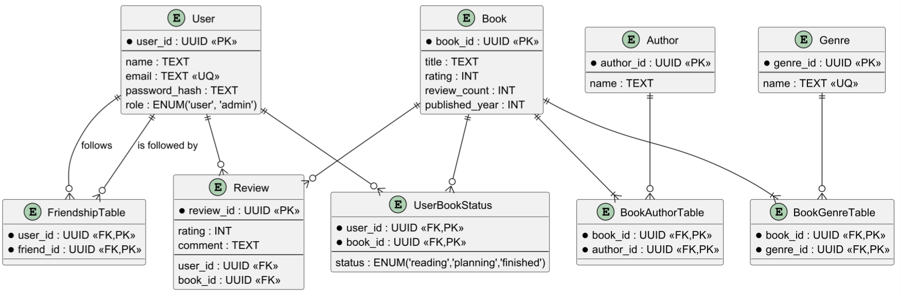
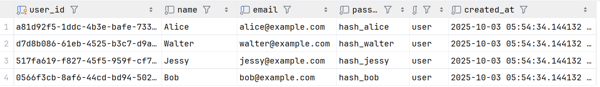
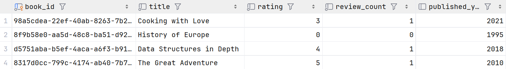
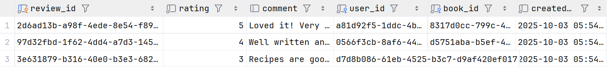
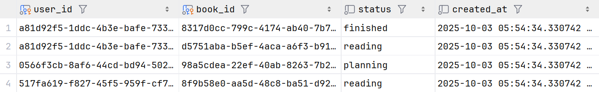
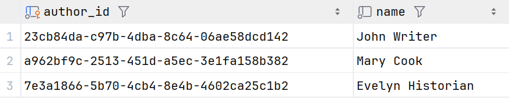
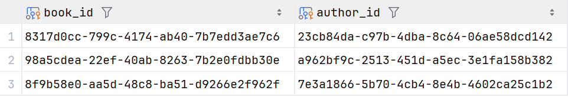
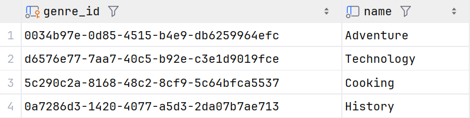
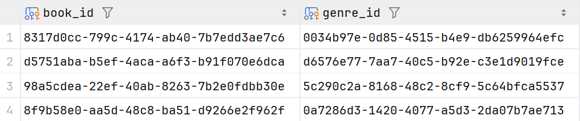
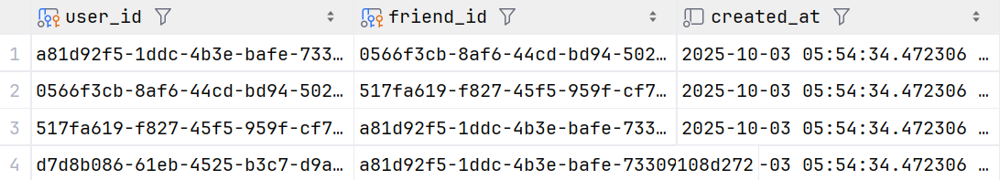

### Лабораторна робота 1

#### Сутності:
- User
- Book 
- Review 
- UserBookStatus 
- Author 
- BookAuthorTable 
- Genre 
- BookGenreTable 
- FriendshipTable

#### Опис
Соціальна платформа для оцінювання книг (IMDB для книг), де користувачі можуть читати, рецензувати та відстежувати книги. Кожна книга може мати кількох авторів та жанрів, користувачі можуть назначати книгам статуси (читаю, у планах, прочитав), писати рецензії та додавати інших користувачів у друзі.

#### Діаграма

### Лабораторна робота 2
#### Таблиці:
**users:**  

**books:**  

**reviews:**  

**user_book_statuses:**  

**authors:**  

**book_authors:**  

**genres:**  

**book_genres:**  

**friendships:**  
