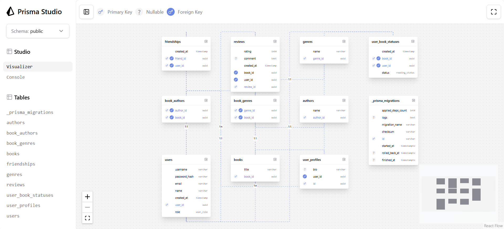

### add-user-profile
- Додано модель UserProfile (таблиця user_profiles).
- Зв’язок 1–1 з User через user_id (FK на users.user_id).

Prisma model (фрагмент):
```prisma
model user_profiles {
  id      String  @id @default(dbgenerated("gen_random_uuid()")) @db.Uuid
  user_id String  @db.Uuid
  bio     String? @db.VarChar(150)
  users   users   @relation(fields: [user_id], references: [user_id], onDelete: Cascade, onUpdate: NoAction, map: "fk_ubs_user")
}
```

### add-username-to-user
- До User додано поле username (nullable, унікальне).
- Мета: окремий логін, не прив'язаний до email.

### drop-book-publish-year
- З Book видалено publish_year.
- Сенсу в цьому нема, просто треба було щось видалити

## Prisma Studio
